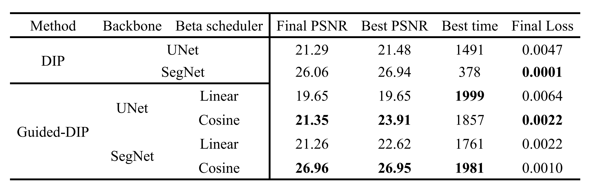

# Guided-DIP
Guiding DIP Early Stopping with DDPM-inspired Supervision

## The framework
The highlight words are parameters for guided-dip. In this project, I do not conduct the ablation studies on it.


## How to start the code
### install Dependencies
* running on your local device
```
pip install -r requirements.txt
```
* running in colab
```
pip install python-dotenv
```
### create the .env file
First, you should copy the `.env.example` to `.env`
```
cp .env.example .env
```
### Download dataset if you need it
```
I recommend you run the code with the images in data/test directory without installing any files first.
```
* replace the your kaggle token to the following two lines in the `.env` file
```
KAGGLE_USERNAME="your user name in kaggle"
KAGGLE_KEY="your api key in kaggle"
```
* Then, run the following shell script. It will download the image from kaggle dataset
```bash
./download_data.sh
```
### Notebook details
* test.ipynb is the demonstration of simple DDPM diffusion forward process and DIP training process on the clean image
* main.ipynb is the notebook for running the Guided-DIP and DIP on noisy image

## How to run with different experiments
* all the settings of dip, ddpm and guided-dip can be altered by rewriting the `config.yaml`, you should follow the `models.model.py` configuration parsing for details.

* Here, I show some changes you can try to rewrite

    * backbone_name: `segnet` or `unet`

    * scheduler: `cosine` or `linear`

    * device: `cuda` or `cpu`
    * For more detailed comparisons, you can change any numerical value to find the best parameter setting (like `count`, `beta_start`, `learning_rate`, etc) in the psnr score

## The whole comparison
### numerical metrics
* With my proposed method **Guided-DIP**, I beat the original DIP in both best PSNR score and final PSNR score by leveraging cosine beta scheduler.
* Another interesting result is that I don't need to set early-stop point anymore. The final result is good enough and the best time is closed to stop time.

### generated results 
* The restored quality is much better when using SegNet


## More details
To see more details, please open the `report.pdf` file. There are pseudo code of the training method, detailed experiment settings, descriptions about every parameters, and snapshots during DIP/Guided-DIP training procedure.

## Acknowledgements 
* [PyTorch Deep Image Prior](https://github.com/safwankdb/Deep-Image-Prior)
* [DDPM from scratch in Pytorch](https://www.kaggle.com/code/vikramsandu/ddpm-from-scratch-in-pytorch)
* [SegNet Pytorch](https://github.com/vinceecws/SegNet_PyTorch/tree/master)
* [chatGPT](https://chatgpt.com/)